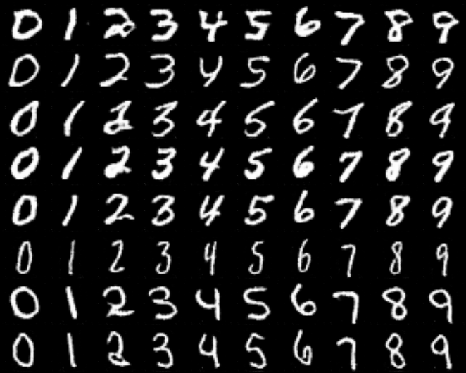
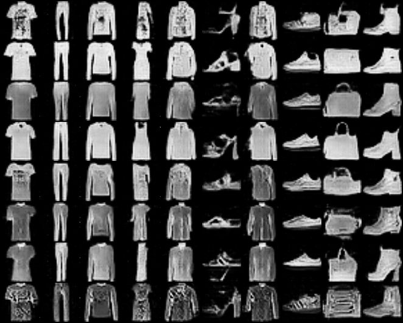

## ACGAN

> Odena, Augustus, Christopher Olah, and Jonathon Shlens. "Conditional image synthesis with auxiliary classifier gans." In International conference on machine learning, pp. 2642-2651. PMLR, 2017.

### MNIST

|              samples during training               |          fixed z for different classes           |
| :------------------------------------------------: | :----------------------------------------------: |
|  |  |

- fixed z for different classes：对每一行，隐变量 z 是相同的，仅改变类别编码。隐变量 z 蕴含了生成图像的特征信息，因而**同一行的图像具有类似的特征**。例如，上图中第四行数字较粗、第六行数字较窄等。

### Fashion-MNIST

|                  samples during training                   |              fixed z for different classes               |
| :--------------------------------------------------------: | :------------------------------------------------------: |
|  |  |

- fixed z for different classes：**同一行的图像具有类似的特征**。例如，上图中第二行颜色偏白、第三行颜色偏灰、最后一行有较多花纹等。

