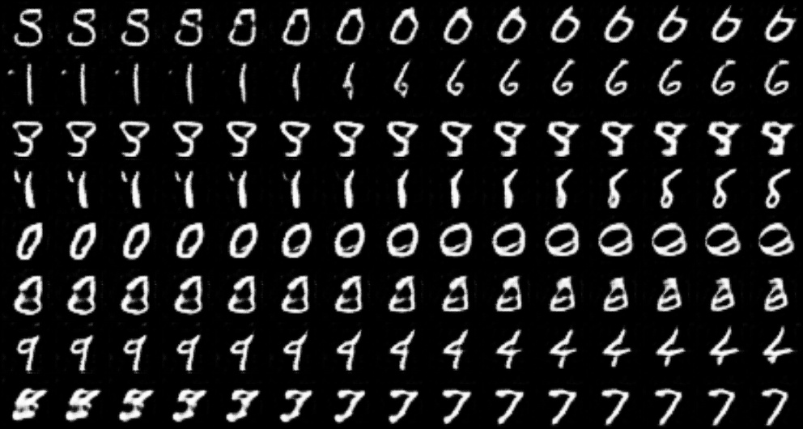
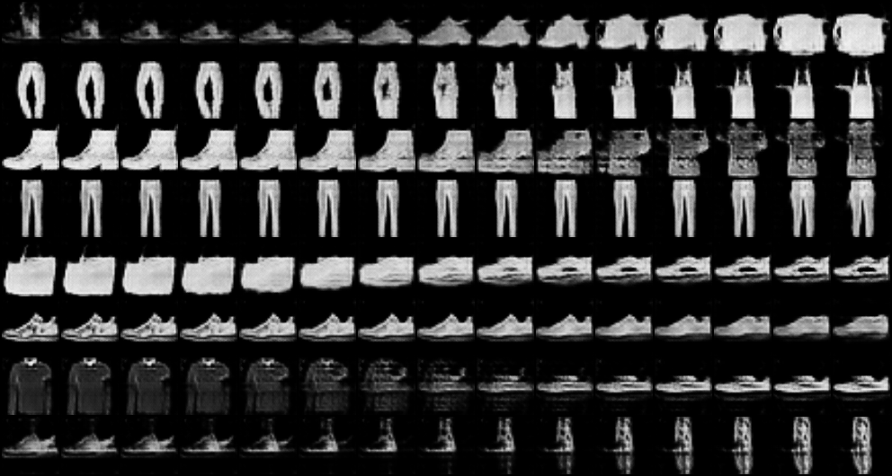
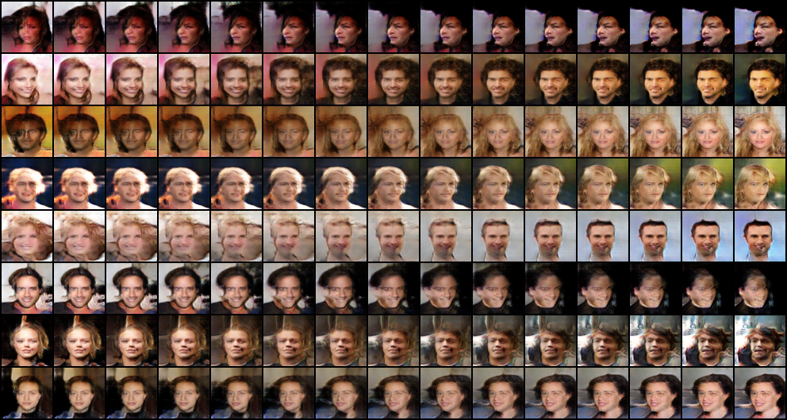

# DCGAN

> Radford, Alec, Luke Metz, and Soumith Chintala. "Unsupervised representation learning with deep convolutional generative adversarial networks." arXiv preprint arXiv:1511.06434 (2015).

## Results

### MNIST

|              samples during training               |              walk in latent space              |
| :------------------------------------------------: | :--------------------------------------------: |
|  |  |

### Fashion-MNIST

|                  samples during training                   |                  walk in latent space                  |
| :--------------------------------------------------------: | :----------------------------------------------------: |
|  |  |

### CelebA

个人经验：参数需要精细调整，否则生成器和判别器对抗不起来。

|               samples during training               |              walk in latent space               |
| :-------------------------------------------------: | :---------------------------------------------: |
|  |  |
