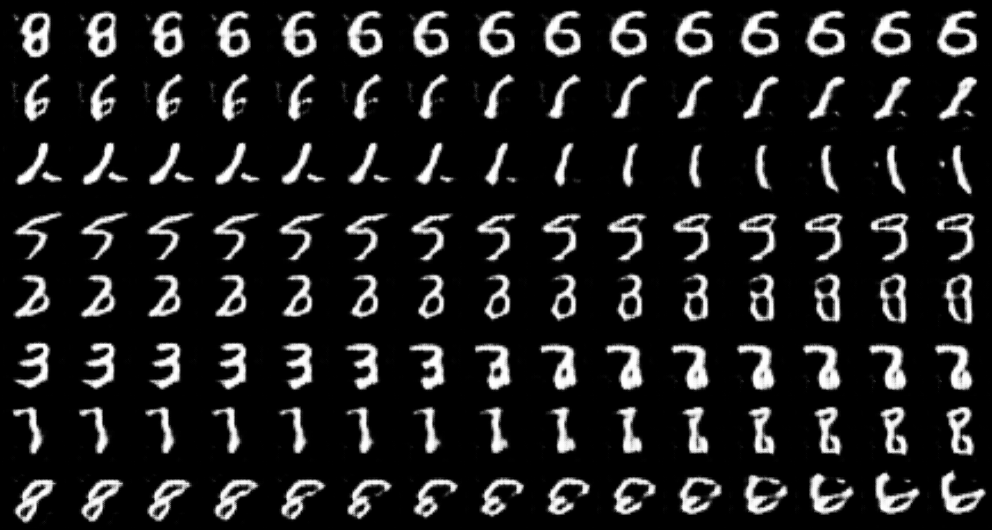
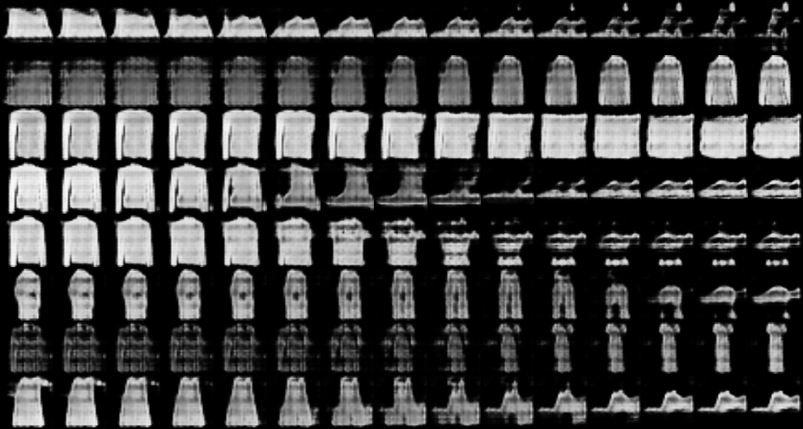
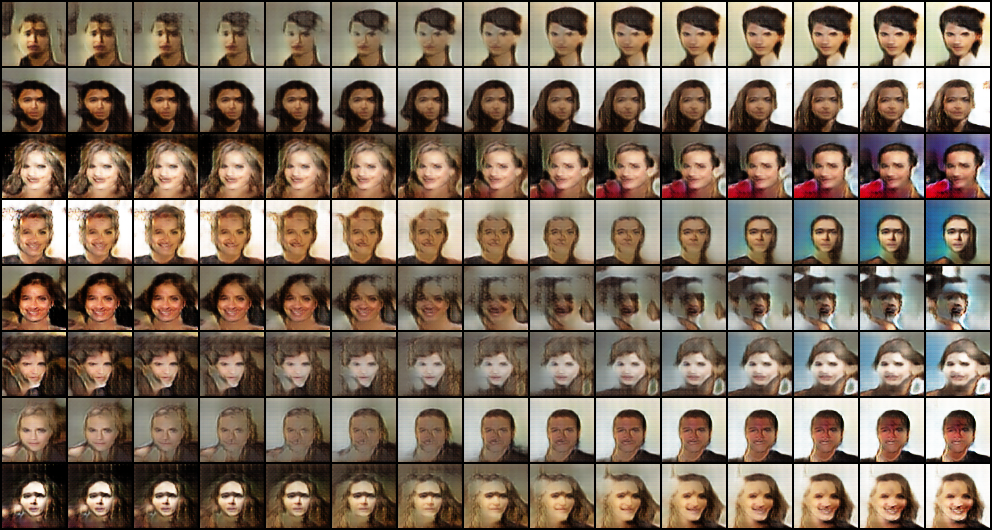

# LSGAN

> Mao, Xudong, Qing Li, Haoran Xie, Raymond YK Lau, Zhen Wang, and Stephen Paul Smolley. "Least squares generative adversarial networks." In Proceedings of the IEEE international conference on computer vision, pp. 2794-2802. 2017.

## Results

### Ring8 (Synthetic Dataset)

为验证 mode collapse 而人工合成的数据集，由 8 个正态分布排列为圆环状构成。

### Grid25 (Synthetic Dataset)

为验证 mode collapse 而人工合成的数据集，由 25 个正态分布排列为 $5\times5$ 格点构成。

### MNIST

|              samples during training               |              walk in latent space              |
| :------------------------------------------------: | :--------------------------------------------: |
|  |  |

### FashionMNIST

|                  samples during training                   |                  walk in latent space                  |
| :--------------------------------------------------------: | :----------------------------------------------------: |
|  |  |

### CelebA

|               samples during training               |              walk in latent space               |
| :-------------------------------------------------: | :---------------------------------------------: |
|  |  |
