# GANs-Implementations

My implementations of GANs with PyTorch.

## Progress

- [x] GAN (vanilla GAN)
- [ ] CGAN
- [x] DCGAN
- [x] WGAN
- [x] WGAN-GP
- [ ] SNGAN
- [ ] SNGAN-projection
- [ ] ACGAN
- [ ] SAGAN
- [ ] LSGAN
- [ ] VEEGAN

 

## Image Generation

### CIFAR-10

**Quantitative results**:

- All the metrics are evaluated on 50k samples.
- The FID is calculated between 50k generated samples and the CIFAR-10 training split.

<table style="text-align: center">
    <tr>
        <th>Type</th>
        <th>Arch</th>
        <th>FID@50k</th>
        <th>IS</th>
    </tr>
    <tr>
        <td>DCGAN</td>
        <td>Simple CNN</td>
        <td>24.8453</td>
        <td>7.1121 ± 0.0690</td>
    </tr>
    <tr>
        <td>WGAN</td>
        <td>Simple CNN</td>
        <td>51.0953</td>
        <td>5.5291 ± 0.0621</td>
    </tr>
</table>

**Visualization**:

<table style="text-align: center">
    <tr>
        <th>DCGAN</th>
        <th>WGAN</th>
        <th>WGAN-GP</th>
    </tr>
    <tr>
        <td></td>
        <td>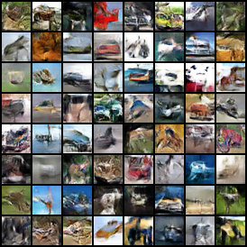</td>
        <td>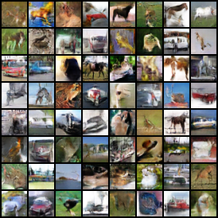</td>
    </tr>
</table>

 

## Mode Collapse Study

Samples during training are shown below.

### GAN

<table style="text-align: center">
    <tr>
        <th>1000 steps</th>
        <th>2000 steps</th>
        <th>3000 steps</th>
        <th>4000 steps</th>
        <th>5000 steps</th>
    </tr>
    <tr>
        <td></td>
        <td>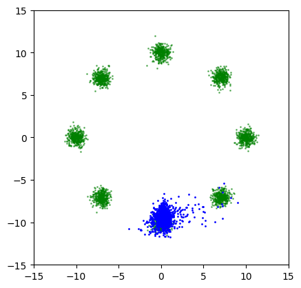</td>
        <td>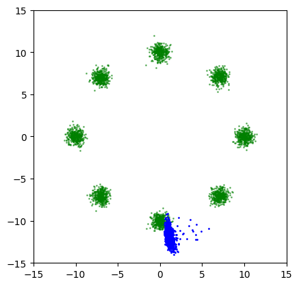</td>
        <td>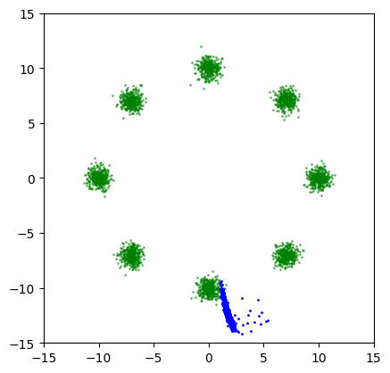</td>
        <td>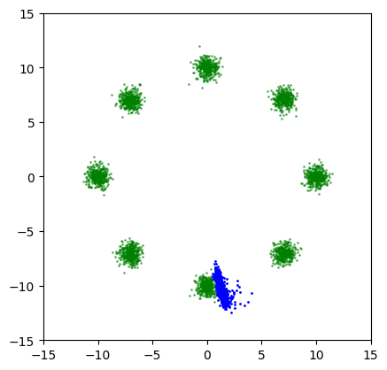</td>
    </tr>
</table>

<table style="text-align: center">
    <tr>
        <th>6000 steps</th>
        <th>12000 steps</th>
        <th>18000 steps</th>
        <th>24000 steps</th>
        <th>50000 steps</th>
    </tr>
    <tr>
        <td>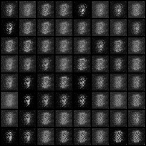</td>
        <td>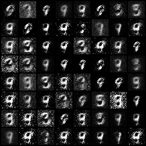</td>
        <td>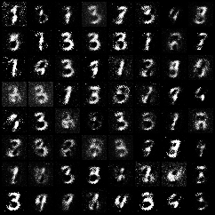</td>
        <td>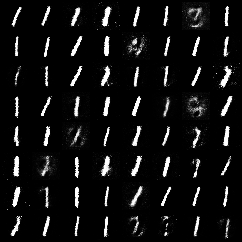</td>
        <td>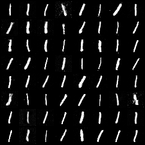</td>
    </tr>
</table>

In the first row, the real dataset is composed of 8 gaussian distributions lying on a ring. It can be clearly seen that all the generated data gather to only one of the 8 modes.

In the MNIST case, the generated images eventually collapse to 1.

### WGAN (weight clipping)

<table style="text-align: center">
    <tr>
        <th>4000 steps</th>
        <th>8000 steps</th>
        <th>12000 steps</th>
        <th>16000 steps</th>
        <th>50000 steps</th>
    </tr>
    <tr>
        <td>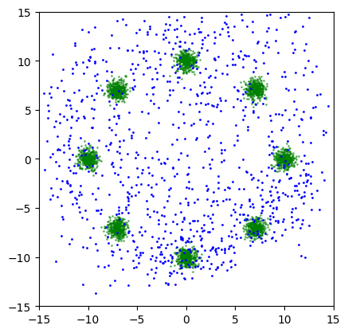</td>
        <td>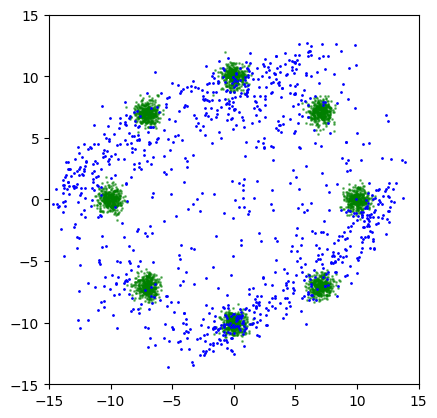</td>
        <td>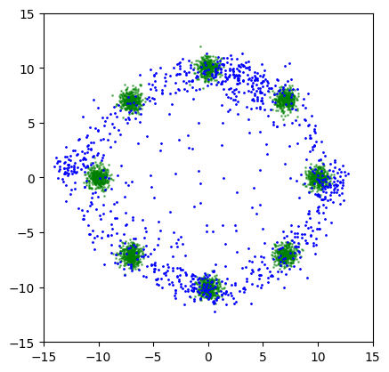</td>
        <td>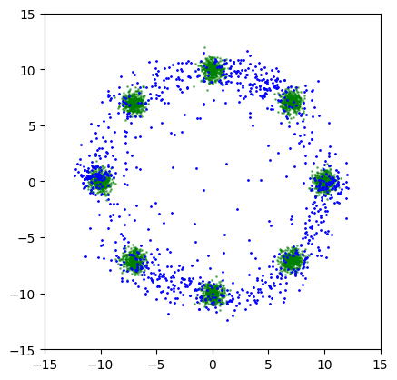</td>
        <td>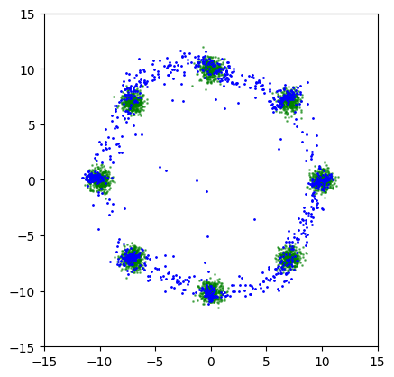</td>
    </tr>
</table>

<table style="text-align: center">
    <tr>
        <th>6000 steps</th>
        <th>12000 steps</th>
        <th>18000 steps</th>
        <th>24000 steps</th>
        <th>100000 steps</th>
    </tr>
    <tr>
        <td>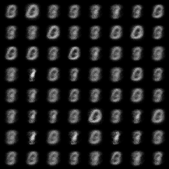</td>
        <td>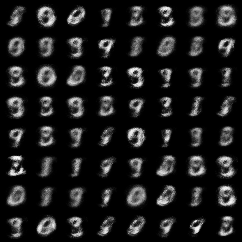</td>
        <td>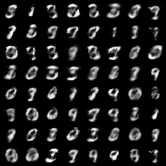</td>
        <td>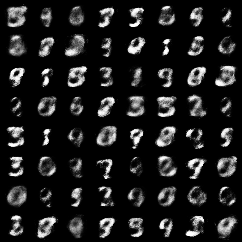</td>
        <td>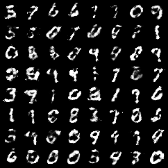</td>
    </tr>
</table>

WGAN indeed resolves the mode collapse problem, but the image quality is not good due to weight clipping.

### WGAN-GP

<table style="text-align: center">
    <tr>
        <th>3000 steps</th>
        <th>6000 steps</th>
        <th>9000 steps</th>
        <th>12000 steps</th>
        <th>50000 steps</th>
    </tr>
    <tr>
        <td>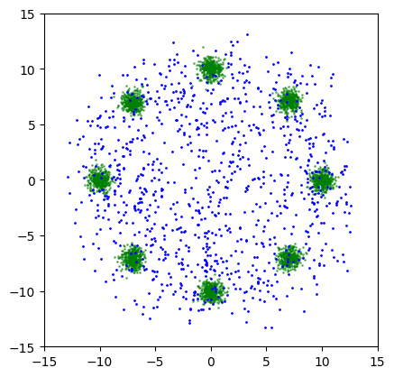</td>
        <td>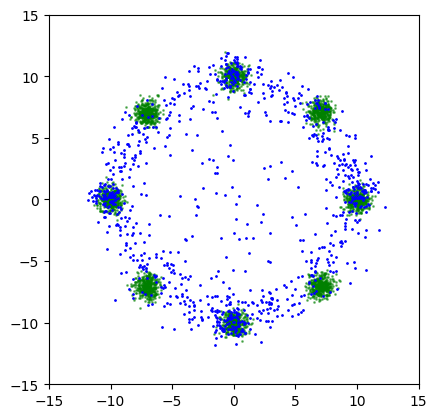</td>
        <td>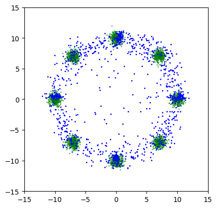</td>
        <td></td>
        <td>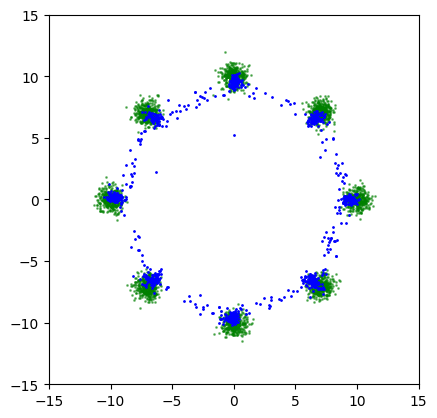</td>
    </tr>
</table>

<table style="text-align: center">
    <tr>
        <th>4000 steps</th>
        <th>8000 steps</th>
        <th>12000 steps</th>
        <th>16000 steps</th>
        <th>100000 steps</th>
    </tr>
    <tr>
        <td>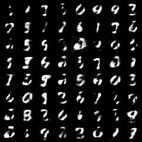</td>
        <td>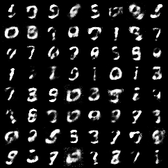</td>
        <td>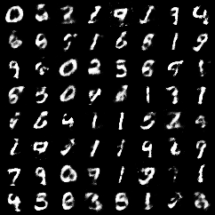</td>
        <td>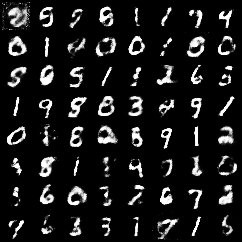</td>
        <td>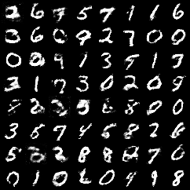</td>
    </tr>
</table>
WGAN-GP improves the quality of WGAN by replacing the hard weight clipping with the soft gradient penalty.

The pathological weights distribution in WGAN's discriminator does not appear in WGAN-GP, as shown below.

    
    

