# GANs-Implementations

Implement GANs with PyTorch.


## Progress

**Unconditional image generation (CIFAR-10)**:

- [x] DCGAN (vanilla GAN)
- [x] DCGAN + R1 regularization
- [x] WGAN
- [x] WGAN-GP
- [x] SNGAN
- [x] LSGAN

**Conditional image generation (CIFAR-10)**:

- [x] CGAN
- [ ] ACGAN
- [ ] SNGAN-projection

**Unsupervised decomposition (MNIST)**:

- [x] InfoGAN

**Mode Collapse Study (Ring8, MNIST)**:

- [x] GAN (vanilla GAN)
- [x] GAN + R1 regularization
- [x] WGAN
- [x] WGAN-GP
- [x] SNGAN
- [x] LSGAN
- [x] VEEGAN

<br/>


## Unconditional Image Generation

**Notes**:

|     Model      | G. Arch.  |    D. Arch.    |                Loss                |                      Configs                      |               Additional args               |
| :------------: | :-------: | :------------: | :--------------------------------: | :-----------------------------------------------: | :-----------------------------------------: |
|     DCGAN      | SimpleCNN |   SimpleCNN    |              Vanilla               |     [config file](./configs/gan_cifar10.yaml)     |                                             |
| DCGAN + R1 reg | SimpleCNN |   SimpleCNN    |   Vanilla<br/>R1 regularization    |     [config file](./configs/gan_cifar10.yaml)     | `--train.loss_fn.params.lambda_r1_reg 10.0` |
|      WGAN      | SimpleCNN |   SimpleCNN    | Wasserstein<br/>(weight clipping)  |    [config file](./configs/wgan_cifar10.yaml)     |                                             |
|    WGAN-GP     | SimpleCNN |   SimpleCNN    | Wasserstein<br/>(gradient penalty) |   [config file](./configs/wgan_gp_cifar10.yaml)   |                                             |
|     SNGAN      | SimpleCNN | SimpleCNN (SN) |              Vanilla               |    [config file](./configs/sngan_cifar10.yaml)    |                                             |
|     SNGAN      | SimpleCNN | SimpleCNN (SN) |               Hinge                | [config file](./configs/sngan_hinge_cifar10.yaml) |                                             |
|     LSGAN      | SimpleCNN |   SimpleCNN    |            Least Sqaure            |    [config file](./configs/lsgan_cifar10.yaml)    |                                             |

- SN stands for "Spectral Normalization".

- For simplicity, the network architecture in all experiments is SimpleCNN, namely a stack of `nn.Conv2d` or `nn.ConvTranspose2d` layers. The results can be improved by adding more parameters and using advanced architectures (e.g., residual connections), but I decide to use the simplest setup here.

- All models except LSGAN are trained for 40k generator update steps. However, the optimizers and learning rates are not optimized for each model, so some models may not reach their optimal performance.


**Quantitative results**:

|        Model         |  FID ↓  | Inception Score ↑ |
| :------------------: | :-----: | :---------------: |
|        DCGAN         | 24.7311 |  7.0339 ± 0.0861  |
|    DCGAN + R1 reg    | 24.1535 |  7.0188 ± 0.1089  |
|         WGAN         | 49.9169 |  5.6852 ± 0.0649  |
|       WGAN-GP        | 28.7963 |  6.7241 ± 0.0784  |
| SNGAN (vanilla loss) | 24.9151 |  6.8838 ± 0.0667  |
|  SNGAN (hinge loss)  | 28.5197 |  6.7429 ± 0.0818  |
|        LSGAN         | 28.4850 |  6.7465 ± 0.0911  |

- The FID is calculated between 50k generated samples and the CIFAR-10 training split (50k images).
- The Inception Score is calculated on 50k generated samples.


**Visualization**:

<table style="text-align: center">
    <tr>
        <th>DCGAN</th>
        <th>DCGAN + R1 reg</th>
        <th>WGAN</th>
        <th>WGAN-GP</th>
    </tr>
    <tr>
        <td></td>
        <td>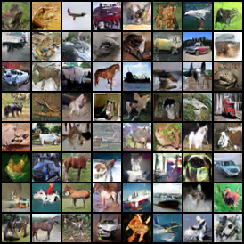</td>
        <td>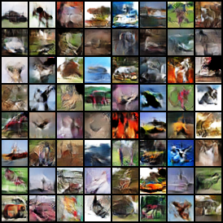</td>
        <td>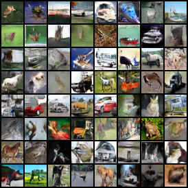</td>
    </tr>
    <tr>
        <th>SNGAN (vanilla loss)</th>
        <th>SNGAN (hinge loss)</th>
        <th>LSGAN</th>
    </tr>
    <tr>
        <td>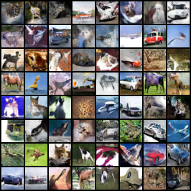</td>
        <td>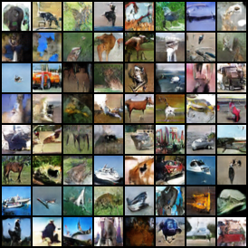</td>
        <td>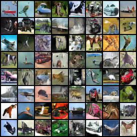</td>
    </tr>
</table>

<br/>


## Conditional Image Generation

**Notes**:

|      Model       | G. Arch.  |    D. Arch.    | G. cond. | D. cond. |  Loss   |                  Configs & Args                  |
| :--------------: | :-------: | :------------: | :------: | :------: | :-----: | :----------------------------------------------: |
|       CGAN       | SimpleCNN |   SimpleCNN    |  concat  |  concat  | Vanilla |    [config file](./configs/cgan_cifar10.yaml)    |
|    CGAN (cBN)    | SimpleCNN |   SimpleCNN    |   cBN    |  concat  | Vanilla |  [config file](./configs/cgan_cbn_cifar10.yaml)  |
|      ACGAN       | SimpleCNN |   SimpleCNN    |   cBN    |    AC    | Vanilla |   [config file](./configs/acgan_cifar10.yaml)    |
| SNGAN-projection | SimpleCNN | SimpleCNN (SN) |   cBN    |    PD    |  Hinge  | [config file](./configs/sngan_proj_cifar10.yaml) |


- cBN stands for "conditional Batch Normalization"; SN stands for "Spectral Normalization"; AC stands for "Auxiliary Classifier"; PD stands for "Projection Discriminator".


**Quantitative results**:

|   Model    |  FID ↓  |                         Intra FID ↓                          | Inception Score ↑ |
| :--------: | :-----: | :----------------------------------------------------------: | :---------------: |
|    CGAN    | 22.7190 | 44.0456<br/>            <details><summary>Details</summary><p>Class 0: 47.4655</p><p>Class 1: 36.7704</p><p>Class 2: 50.4781</p><p>Class 3: 47.7560</p><p>Class 4: 38.8245</p><p>Class 5: 58.8605</p><p>Class 6: 36.9275</p><p>Class 7: 43.9562</p><p>Class 8: 38.1152</p><p>Class 9: 41.3024</p></details> |  7.6483 ± 0.0805  |
| CGAN (cBN) | 23.7573 | 45.7831<br/>                <details><summary>Details</summary><p>Class 0: 50.4719</p><p>Class 1: 41.0282</p><p>Class 2: 51.2398</p><p>Class 3: 49.0277</p><p>Class 4: 34.7383</p><p>Class 5: 62.6589</p><p>Class 6: 39.2291</p><p>Class 7: 43.1215</p><p>Class 8: 44.1361</p><p>Class 9: 42.1792</p></details> |  7.8448 ± 0.0574  |
|            |         |                                                              |                   |
|            |         |                                                              |                   |


- The FID is calculated between 50k generated samples (5k for each class) and the CIFAR-10 training split (50k images).
- The intra FID is calculated between 5k generated samples and CIFAR-10 training split within each class.
- The Inception Score is calculated on 50k generated samples.


**Visualizations**:

<table style="text-align: center">
    <tr>
        <th>CGAN</th>
        <th>CGAN (cBN)</th>
    </tr>
    <tr>
        <td>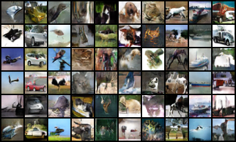</td>
        <td>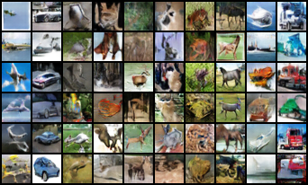</td>
    </tr>
    <tr>
        <th>ACGAN</th>
        <th>SNGAN-Projection</th>
    </tr>
    <tr>
        <td></td>
        <td></td>
    </tr>
</table>

<br/>


## Unsupervised decomposition

**InfoGAN**

<p align="center">
  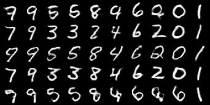
  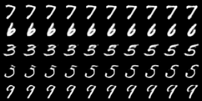
</p>

- Left: change the discrete latent variable, which corresponds to the digit type.
- Right: change one of the continuous latent variable from -1 to 1. However, the decomposition is not clear.
- Note: I found that batch normalization layers play an important role in InfoGAN. Without BN layers, the discrete latent variable tends to have a clear meaning as shown above, while the continuous variables have little effect. On the contrary, with BN layers, it's harder for the discrete variable to catch the digit type information and easier for continuous ones to find rotation in digits.

<br/>


## Mode Collapse Study

Mode collapse is a notorious problem in GANs, where the model can only generate a few modes of the real data. Various methods have been proposed to solve it. To study this problem, I experimented different methods on the following two datasets:

- **Ring8**: eight gaussian distributions lying on a ring.
- **MNIST**: handwritten digit dataset.

For simplicity, the model architecture in all experiments is SimpleMLP, namely a stack of `nn.Linear` layers, thus the quality of generated MNIST image may not be so good. However, this section aims to demonstrate the mode collapse problem rather than to achieve the best image quality.

<br/>

**GAN**

<table style="text-align: center">
    <tr>
        <th>200 steps</th>
        <th>400 steps</th>
        <th>600 steps</th>
        <th>800 steps</th>
        <th>1000 steps</th>
    </tr>
    <tr>
        <td>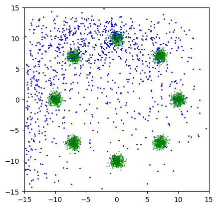</td>
        <td>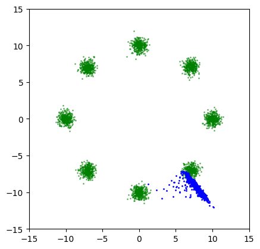</td>
        <td>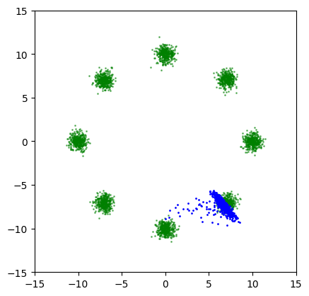</td>
        <td>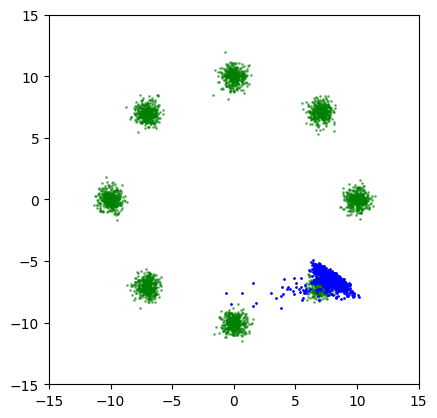</td>
        <td>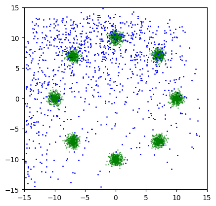</td>
    </tr>
</table>

<table style="text-align: center">
    <tr>
        <th>1000 steps</th>
        <th>2000 steps</th>
        <th>3000 steps</th>
        <th>4000 steps</th>
        <th>5000 steps</th>
    </tr>
    <tr>
        <td>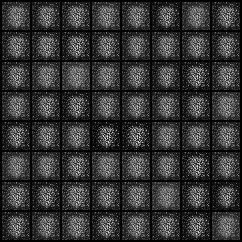</td>
        <td>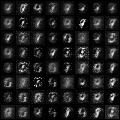</td>
        <td>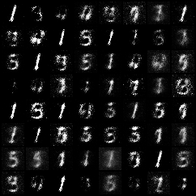</td>
        <td></td>
        <td>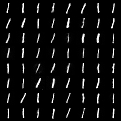</td>
    </tr>
</table>

On the Ring8 dataset, it can be clearly seen that all the generated data gather to only one of the 8 modes.

In the MNIST case, the generated images eventually collapse to 1.

<br/>

**GAN + R1 regularization**

<table style="text-align: center">
    <tr>
        <th>200 steps</th>
        <th>400 steps</th>
        <th>600 steps</th>
        <th>800 steps</th>
        <th>5000 steps</th>
    </tr>
    <tr>
        <td>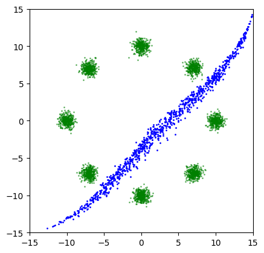</td>
        <td>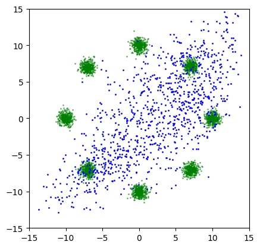</td>
        <td>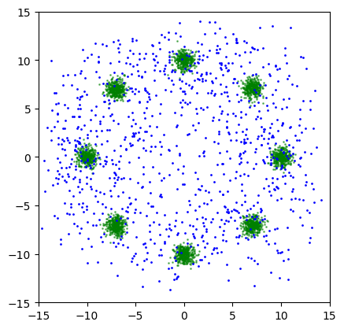</td>
        <td>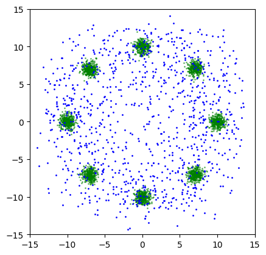</td>
        <td>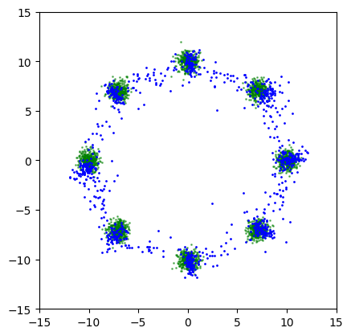</td>
    </tr>
</table>

<table style="text-align: center">
    <tr>
        <th>1000 steps</th>
        <th>3000 steps</th>
        <th>5000 steps</th>
        <th>7000 steps</th>
        <th>9000 steps</th>
    </tr>
    <tr>
        <td>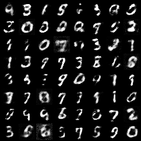</td>
        <td>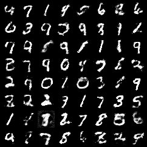</td>
        <td>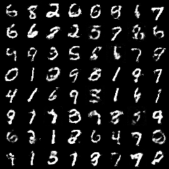</td>
        <td>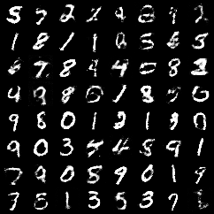</td>
        <td>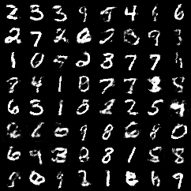</td>
    </tr>
</table>

R1 regularization, a technique to stabilize the training process of GANs, can prevent mode collapse in vanilla GAN as well.

<br/>

**WGAN**

<table style="text-align: center">
    <tr>
        <th>200 steps</th>
        <th>400 steps</th>
        <th>600 steps</th>
        <th>800 steps</th>
        <th>5000 steps</th>
    </tr>
    <tr>
        <td>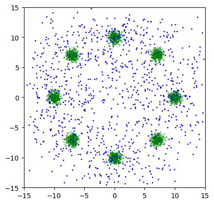</td>
        <td>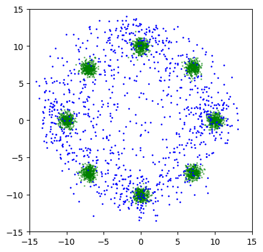</td>
        <td></td>
        <td>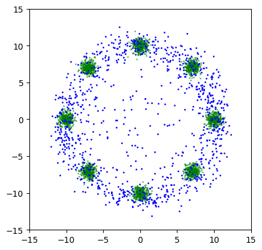</td>
        <td>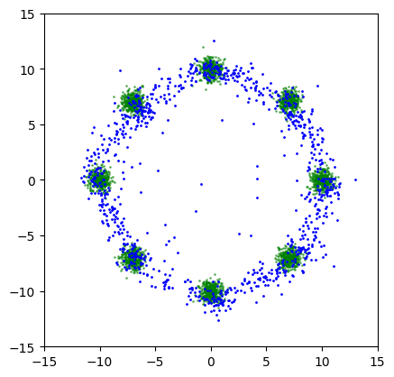</td>
    </tr>
</table>

<table style="text-align: center">
    <tr>
        <th>1000 steps</th>
        <th>3000 steps</th>
        <th>5000 steps</th>
        <th>7000 steps</th>
        <th>9000 steps</th>
    </tr>
    <tr>
        <td>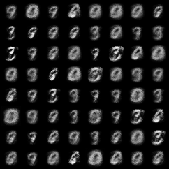</td>
        <td>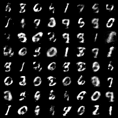</td>
        <td>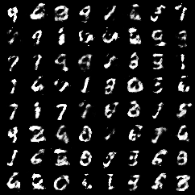</td>
        <td>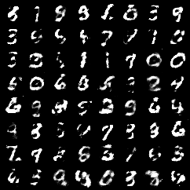</td>
        <td>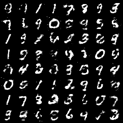</td>
    </tr>
</table>

WGAN indeed resolves the mode collapse problem, but converges much slower due to weight clipping.

<br/>

**WGAN-GP**

<table style="text-align: center">
    <tr>
        <th>200 steps</th>
        <th>400 steps</th>
        <th>600 steps</th>
        <th>800 steps</th>
        <th>5000 steps</th>
    </tr>
    <tr>
        <td>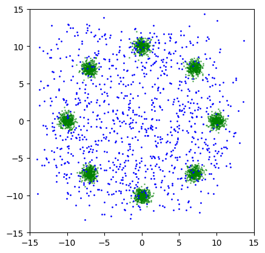</td>
        <td>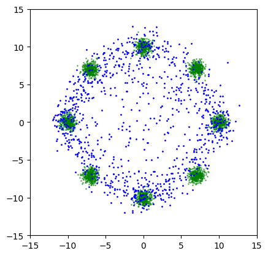</td>
        <td>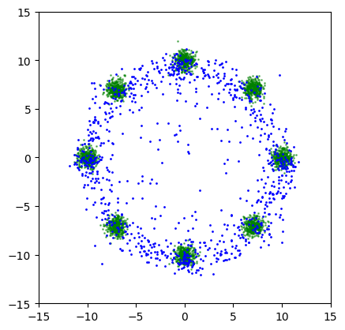</td>
        <td>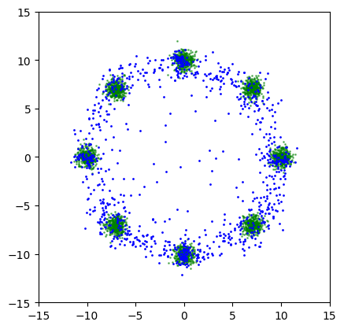</td>
        <td>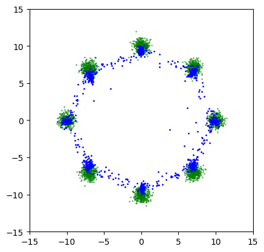</td>
    </tr>
</table>

<table style="text-align: center">
    <tr>
        <th>1000 steps</th>
        <th>3000 steps</th>
        <th>5000 steps</th>
        <th>7000 steps</th>
        <th>9000 steps</th>
    </tr>
    <tr>
        <td>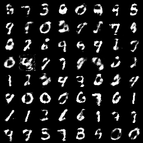</td>
        <td>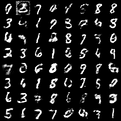</td>
        <td>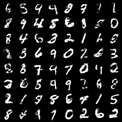</td>
        <td>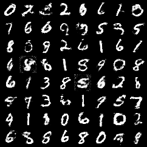</td>
        <td>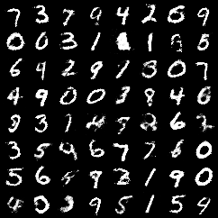</td>
    </tr>
</table>

WGAN-GP improves WGAN by replacing the hard weight clipping with the soft gradient penalty.

The pathological weights distribution in WGAN's discriminator does not appear in WGAN-GP, as shown below.

<p style="text-align: center">
    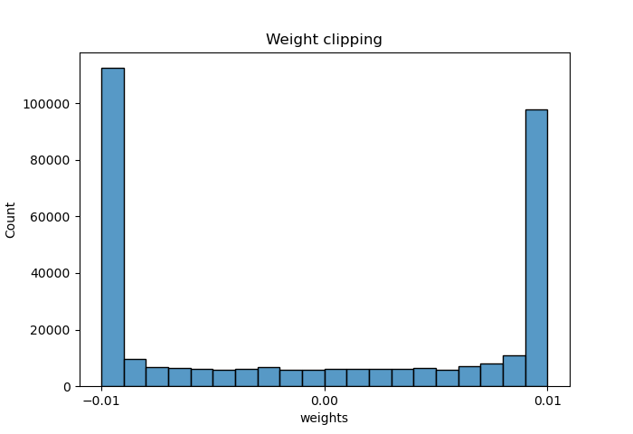
    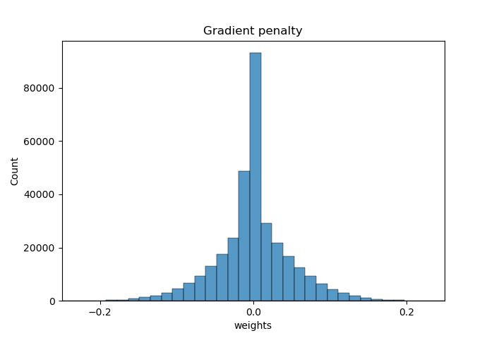
</p>
<br/>

**SNGAN**

<table style="text-align: center">
    <tr>
        <th>200 steps</th>
        <th>400 steps</th>
        <th>600 steps</th>
        <th>800 steps</th>
        <th>5000 steps</th>
    </tr>
    <tr>
        <td></td>
        <td></td>
        <td></td>
        <td></td>
        <td></td>
    </tr>
</table>

<table style="text-align: center">
    <tr>
        <th>1000 steps</th>
        <th>3000 steps</th>
        <th>5000 steps</th>
        <th>7000 steps</th>
        <th>9000 steps</th>
    </tr>
    <tr>
        <td></td>
        <td></td>
        <td></td>
        <td></td>
        <td></td>
    </tr>
</table>

Note: The above SNGAN is trained with the vanilla GAN loss instead of the hinge loss.

SNGAN uses spectral normalization to control the Lipschitz constant of the discriminator. Even with the vanilla GAN loss, SNGAN can avoid mode collapse problem.

<br/>

**LSGAN**

<table style="text-align: center">
    <tr>
        <th>200 steps</th>
        <th>400 steps</th>
        <th>600 steps</th>
        <th>800 steps</th>
        <th>5000 steps</th>
    </tr>
    <tr>
        <td></td>
        <td></td>
        <td></td>
        <td></td>
        <td></td>
    </tr>
</table>

<table style="text-align: center">
    <tr>
        <th>1000 steps</th>
        <th>3000 steps</th>
        <th>5000 steps</th>
        <th>7000 steps</th>
        <th>9000 steps</th>
    </tr>
    <tr>
        <td></td>
        <td></td>
        <td></td>
        <td></td>
        <td></td>
    </tr>
</table>

LSGAN uses MSE instead of Cross-Entropy as the loss function to overcome the vanishing gradients in vanilla GAN. However, it still suffers from the mode collapse problem. For example, as shown above, LSGAN fails to cover all 8 modes on the Ring8 dataset.

Note: Contrary to the claim in the paper, I found that LSGAN w/o batch normalization does not converge on MNIST.

<br/>

**VEEGAN**

<table style="text-align: center">
    <tr>
        <th>200 steps</th>
        <th>400 steps</th>
        <th>600 steps</th>
        <th>800 steps</th>
        <th>5000 steps</th>
    </tr>
    <tr>
        <td></td>
        <td></td>
        <td></td>
        <td></td>
        <td></td>
    </tr>
</table>

<table style="text-align: center">
    <tr>
        <th>1000 steps</th>
        <th>3000 steps</th>
        <th>5000 steps</th>
        <th>7000 steps</th>
        <th>10000 steps</th>
    </tr>
    <tr>
        <td></td>
        <td></td>
        <td></td>
        <td></td>
        <td></td>
    </tr>
</table>

VEEGAN uses an extra network to reconstruct the latent codes from the generated data.


## Run the code


### Train

For GAN, WGAN-GP, SNGAN, LSGAN:

```shell
accelerate-launch scripts/train.py -c ./configs/xxx.yaml
```

For WGAN (weight clipping), InfoGAN and VEEGAN, use the scripts with corresponding name instead:

```shell
accelerate-launch scripts/train_xxxgan.py -c ./configs/xxx.yaml
```


### Sample

**Unconditional**:

```shell
accelerate-launch scripts/sample.py \
    -c ./configs/xxx.yaml \
    --weights /path/to/saved/ckpt/model.pt \
    --n_samples N_SAMPLES \
    --save_dir SAVE_DIR
```

**Conditioned on class labels**:

```shell
accelerate-launch scripts/sample_cond.py \
    -c ./configs/xxx.yaml \
    --weights /path/to/saved/ckpt/model.pt \
    --n_classes N_CLASSES \
    --n_samples_per_class N_SAMPLES_PER_CLASS \
    --save_dir SAVE_DIR
```


### Evaluate

Sample images following the instructions above and use tools like [torch-fidelity](https://github.com/toshas/torch-fidelity) to calculate FID / IS.

