# Repro-GANs

Reproduce various GANs with PyTorch. 


## Progress

- [x] GAN (vanilla GAN)
- [x] CGAN
- [x] DCGAN
- [x] WGAN
- [x] WGAN-GP
- [x] SNGAN
- [x] SNGAN-projection
- [x] ACGAN
- [x] SAGAN
- [x] LSGAN
- [x] VEEGAN


## Training

Run command:

```shell
python train.py \
    --config_path CONFIG_PATH \
    --model {gan,dcgan,cgan,acgan,wgan,wgan-gp,sngan,sngan-projection,lsgan,sagan,veegan}
```

Some examples of configuration files are under `./configs/`, you can directly use them to train the models, or modify them as you wish.


## Generation

Run command:

```shell
python generate.py \
    --model {gan,dcgan,cgan,acgan,wgan,wgan-gp,sngan,sngan-projection,lsgan,sagan,veegan} \
    --model_path MODEL_PATH \
    --mode {random,walk} \
    --save_path SAVE_PATH \
    --z_dim Z_DIM \
    [--cpu] \
    [--n_classes N_CLASSES] \
    [--data_dim DATA_DIM] \
    [--img_size IMG_SIZE] \
    [--img_channels IMG_CHANNELS]
```


## Results


### GAN (Vanilla GAN)

   

The **mode collapse** problem can be clearly observed.


### WGAN

  


### WGAN-GP

  


### VEEGAN

  


### DCGAN

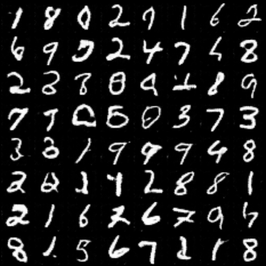


### SNGAN

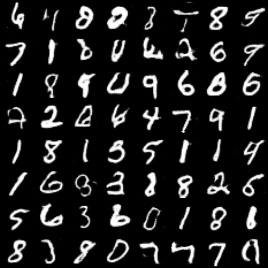 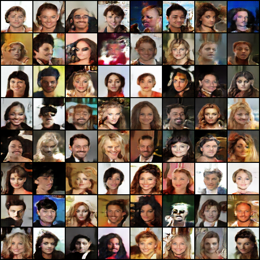


### LSGAN

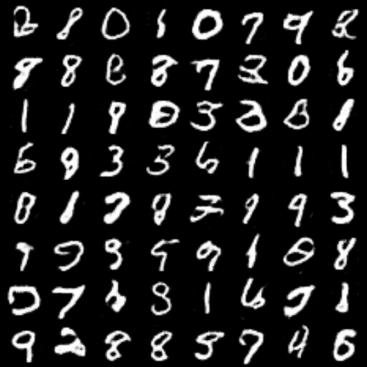 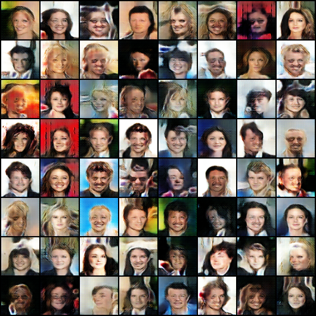


### SAGAN

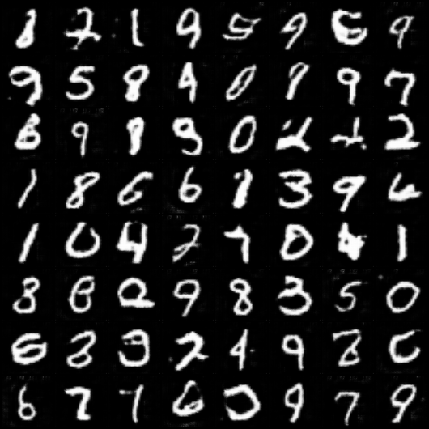 


### CGAN

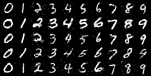 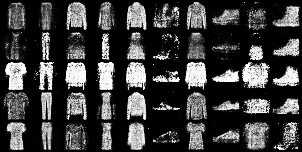


### ACGAN

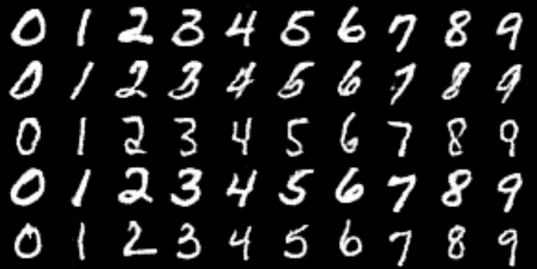 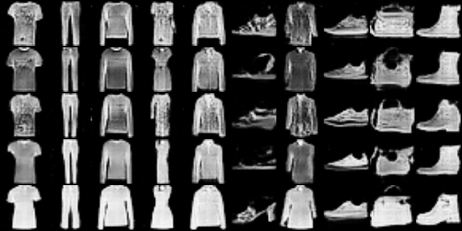


### SNGAN-projection

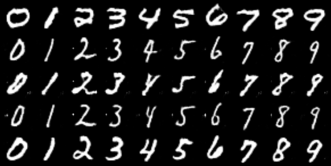 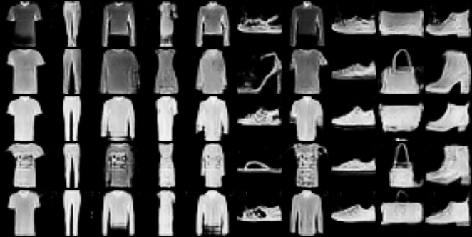
