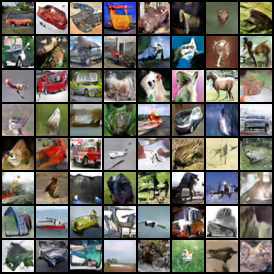

# GANs-Implementations

My implementations of GANs with PyTorch.

## Progress

- [x] GAN (vanilla GAN)
- [ ] CGAN
- [x] DCGAN
- [ ] WGAN
- [ ] WGAN-GP
- [ ] SNGAN
- [ ] SNGAN-projection
- [ ] ACGAN
- [ ] SAGAN
- [ ] LSGAN
- [ ] VEEGAN

## Quantitative Results

### CIFAR-10

- All the metrics are tested on 50k samples.
- The FID is calculated between 50k generated samples and the CIFAR-10 training split.

<table style="text-align: center">
    <tr>
        <th>Type</th>
        <th>Arch</th>
        <th>FID@50k</th>
        <th>IS</th>
    </tr>
    <tr>
        <td>DCGAN</td>
        <td>Simple CNN</td>
        <td>24.8453</td>
        <td>7.1121 ± 0.0690</td>
    </tr>
</table>

## Visualizations

### GAN (Vanilla GAN)

### DCGAN

