# GANs-Implementations

Implement GANs with PyTorch.


## Progress

**Unconditional image generation (CIFAR-10)**:

- [x] GAN (vanilla GAN)
- [x] DCGAN
- [x] WGAN
- [x] WGAN-GP
- [x] SNGAN
- [ ] SAGAN
- [x] LSGAN
- [ ] VEEGAN

**Conditional image generation (CIFAR-10)**:

- [ ] CGAN
- [ ] ACGAN
- [ ] SNGAN-projection

<br/>


## Unconditional Image Generation

**Notes**:

<table style="text-align: center">
    <tr>
        <th>Model</th>
        <th>Loss</th>
        <th>G. Arch.</th>
        <th>D. Arch.</th>
        <th>Configs & Args</th>
    </tr>
    <tr>
        <td>DCGAN</td>
        <td>Vanilla</td>
        <td>SimpleCNN</td>
        <td>SimpleCNN</td>
        <td><a href="./configs/dcgan_cifar10.yaml">config file</a></td>
    </tr>
    <tr>
        <td>WGAN</td>
        <td>Wasserstein<br/>(weight clipping)</td>
        <td>SimpleCNN</td>
        <td>SimpleCNN</td>
        <td><a href="./configs/wgan_cifar10.yaml">config file</a></td>
    </tr>
    <tr>
        <td>WGAN-GP</td>
        <td>Wasserstein<br/>(gradient penalty)</td>
        <td>SimpleCNN</td>
        <td>SimpleCNN</td>
        <td><a href="./configs/wgan_gp_cifar10.yaml">config file</a></td>
    </tr>
    <tr>
        <td>SNGAN</td>
        <td>Vanilla</td>
        <td>SimpleCNN</td>
        <td>SimpleCNN (SN)</td>
        <td><a href="./configs/sngan_cifar10.yaml">config file</a></td>
    </tr>
    <tr>
        <td>SNGAN</td>
        <td>Hinge</td>
        <td>SimpleCNN</td>
        <td>SimpleCNN</td>
        <td>
            <a href="./configs/sngan_cifar10.yaml">config file</a><br/>
            `--train.loss_type hinge`
        </td>
    </tr>
    <tr>
        <td>LSGAN</td>
        <td>Least Sqaure</td>
        <td>SimpleCNN</td>
        <td>SimpleCNN</td>
        <td><a href="./configs/lsgan_cifar10.yaml">config file</a></td>
    </tr>
    <tr>
        <td>SAGAN</td>
        <td>Hinge</td>
        <td>SimpleCNN (SN)<br/>+ Attention</td>
        <td>SimpleCNN (SN)</td>
        <td><a href="./configs/sagan_cifar10.yaml">config file</a></td>
    </tr>
</table>


- For simplicity, the network architecture in all experiments is SimpleCNN, namely a stack of `nn.Conv2d` or `nn.ConvTranspose2d` layers. The results can be improved by adding more parameters and using advanced architectures (e.g., residual connections), but I decide to use the simplest setup here.

- All models except LSGAN are trained for 40k generator update steps. However, the optimizers and learning rates are different for each model, so some models may not reach their optimal performance.

  LSGAN is early-stopped at 30k steps because I found the image quality drops between 30k-40k steps.


**Quantitative results**:

<table style="text-align: center">
    <tr>
        <th>Model</th>
        <th>FID ↓</th>
        <th>Inception Score ↑</th>
    </tr>
    <tr>
        <td>DCGAN</td>
        <td>24.8453</td>
        <td>7.1121 ± 0.0690</td>
    </tr>
    <tr>
        <td>WGAN</td>
        <td>51.0953</td>
        <td>5.5291 ± 0.0621</td>
    </tr>
    <tr>
        <td>WGAN-GP</td>
        <td>31.8783</td>
        <td>6.7391 ± 0.0814</td>
    </tr>
    <tr>
        <td>SNGAN<br/>(with vanilla loss)</td>
        <td>27.2486</td>
        <td>6.9839 ± 0.0774</td>
    </tr>
    <tr>
        <td>SNGAN<br/>(with hinge loss)</td>
        <td>28.7972</td>
        <td>6.8365 ± 0.0787</td>
    </tr>
    <tr>
        <td>LSGAN</td>
        <td>35.2344</td>
        <td>6.3496 ± 0.0748</td>
    </tr>
    <tr>
        <td>SAGAN</td>
        <td></td>
        <td></td>
    </tr>
</table>
- The FID is calculated between 50k generated samples and the CIFAR-10 training split (50k images).
- The Inception Score is calculated on 50k generated samples.


**Visualization**:

<table style="text-align: center">
    <tr>
        <th>DCGAN</th>
        <th>WGAN</th>
        <th>WGAN-GP</th>
    </tr>
    <tr>
        <td></td>
        <td></td>
        <td></td>
    </tr>
    <tr>
        <th>SNGAN (vanilla loss)</th>
        <th>SNGAN (hinge loss)</th>
        <th>LSGAN</th>
    </tr>
    <tr>
        <td>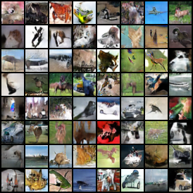</td>
        <td>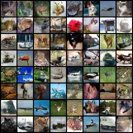</td>
        <td>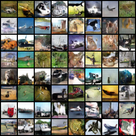</td>
    </tr>
</table>


<br/>


## Conditional Image Generation

**Notes**:

<table style="text-align: center">
    <tr>
        <th>Model</th>
        <th>Loss</th>
        <th>G. Arch.</th>
        <th>D. Arch.</th>
        <th>G. cond.</th>
        <th>D. cond.</th>
		<th>Configs & Args</th>
    </tr>
    <tr>
        <td>CGAN</td>
        <td>Vanilla</td>
        <td>SimpleCNN</td>
        <td>SimpleCNN</td>
        <td>concat</td>
        <td>concat</td>
        <td><a href="./configs/cgan_cifar10.yaml">config file</a></td>
    </tr>
    <tr>
        <td>CGAN (cBN)</td>
        <td>Vanilla</td>
        <td>SimpleCNN</td>
        <td>SimpleCNN</td>
        <td>cBN</td>
        <td>concat</td>
        <td><a href="./configs/cgan_cbn_cifar10.yaml">config file</a></td>
    </tr>
    <tr>
        <td>ACGAN</td>
        <td>Vanilla</td>
        <td>SimpleCNN</td>
        <td>SimpleCNN</td>
        <td>concat</td>
        <td>auxiliary classifier</td>
        <td><a href="./configs/acgan_cifar10.yaml">config file</a></td>
    </tr>
    <tr>
        <td>SNGAN-projection</td>
        <td>Hinge</td>
        <td>SimpleCNN</td>
        <td>SimpleCNN (SN)</td>
        <td>cBN</td>
        <td>projection discriminator</td>
        <td><a href="./configs/sngan_proj_cifar10.yaml">config file</a></td>
    </tr>
</table>


**Quantitative results**:

<table style="text-align: center">
    <tr>
        <th>Model</th>
        <th>FID ↓</th>
        <th>intra FID ↓</th>
        <th>Inception Score ↑</th>
    </tr>
    <tr>
        <td>CGAN</td>
        <td>22.7190</td>
        <td>44.0456<br/>
            <details>
                <summary>Details</summary>
                <p>Class 0: 47.4655</p>
                <p>Class 1: 36.7704</p>
                <p>Class 2: 50.4781</p>
                <p>Class 3: 47.7560</p>
                <p>Class 4: 38.8245</p>
                <p>Class 5: 58.8605</p>
                <p>Class 6: 36.9275</p>
                <p>Class 7: 43.9562</p>
                <p>Class 8: 38.1152</p>
                <p>Class 9: 41.3024</p>
            </details>
        </td>
        <td>7.6483 ± 0.0805</td>
    </tr>
    <tr>
        <td>CGAN (with cBN)</td>
        <td>23.7573</td>
        <td>45.7831<br/>
            <details>
                <summary>Details</summary>
                <p>Class 0: 50.4719</p>
                <p>Class 1: 41.0282</p>
                <p>Class 2: 51.2398</p>
                <p>Class 3: 49.0277</p>
                <p>Class 4: 34.7383</p>
                <p>Class 5: 62.6589</p>
                <p>Class 6: 39.2291</p>
                <p>Class 7: 43.1215</p>
                <p>Class 8: 44.1361</p>
                <p>Class 9: 42.1792</p>
            </details>
        </td>
        <td>7.8448 ± 0.0574</td>
    </tr>
</table>


- The FID is calculated between 50k generated samples (5k for each class) and the CIFAR-10 training split (50k images).
- The intra FID is calculated between 5k generated samples and CIFAR-10 training split within each class.
- The Inception Score is calculated on 50k generated samples.


**Visualizations**:

<table style="text-align: center">
    <tr>
        <th>CGAN</th>
        <th>CGAN (cBN)</th>
    </tr>
    <tr>
        <td></td>
        <td></td>
    </tr>
    <tr>
        <th>ACGAN</th>
        <th>SNGAN-Projection</th>
    </tr>
    <tr>
        <td></td>
        <td></td>
    </tr>
</table>


<br/>


## Mode Collapse Study

Mode collapse is a notorious problem in GANs, where the model can only generate a few modes of the real data. Various methods have been proposed to solve it. To study this problem, I experimented different methods on the following two datasets:

- **Ring8**: eight gaussian distributions lying on a ring.
- **MNIST**: handwritten digit dataset.

For simplicity, the model architecture in all experiments is SimpleMLP, namely a stack of `nn.Linear` layers, thus the quality of generated MNIST image may not be so good. However, this section aims to demonstrate the mode collapse problem rather than to achieve the best image quality.


### GAN

<table style="text-align: center">
    <tr>
        <th>1000 steps</th>
        <th>2000 steps</th>
        <th>3000 steps</th>
        <th>4000 steps</th>
        <th>5000 steps</th>
    </tr>
    <tr>
        <td></td>
        <td></td>
        <td></td>
        <td></td>
        <td></td>
    </tr>
</table>

<table style="text-align: center">
    <tr>
        <th>6000 steps</th>
        <th>12000 steps</th>
        <th>18000 steps</th>
        <th>24000 steps</th>
        <th>50000 steps</th>
    </tr>
    <tr>
        <td></td>
        <td></td>
        <td></td>
        <td></td>
        <td></td>
    </tr>
</table>

On the Ring8 dataset, it can be clearly seen that all the generated data gather to only one of the 8 modes.

In the MNIST case, the generated images eventually collapse to 1.


### WGAN (weight clipping)

<table style="text-align: center">
    <tr>
        <th>4000 steps</th>
        <th>8000 steps</th>
        <th>12000 steps</th>
        <th>16000 steps</th>
        <th>50000 steps</th>
    </tr>
    <tr>
        <td></td>
        <td></td>
        <td></td>
        <td></td>
        <td></td>
    </tr>
</table>

<table style="text-align: center">
    <tr>
        <th>6000 steps</th>
        <th>12000 steps</th>
        <th>18000 steps</th>
        <th>24000 steps</th>
        <th>100000 steps</th>
    </tr>
    <tr>
        <td></td>
        <td></td>
        <td></td>
        <td></td>
        <td></td>
    </tr>
</table>

WGAN indeed resolves the mode collapse problem, but converges much slower due to weight clipping.


### WGAN-GP

<table style="text-align: center">
    <tr>
        <th>3000 steps</th>
        <th>6000 steps</th>
        <th>9000 steps</th>
        <th>12000 steps</th>
        <th>50000 steps</th>
    </tr>
    <tr>
        <td></td>
        <td></td>
        <td></td>
        <td></td>
        <td></td>
    </tr>
</table>

<table style="text-align: center">
    <tr>
        <th>4000 steps</th>
        <th>8000 steps</th>
        <th>12000 steps</th>
        <th>16000 steps</th>
        <th>100000 steps</th>
    </tr>
    <tr>
        <td></td>
        <td></td>
        <td></td>
        <td></td>
        <td></td>
    </tr>
</table>
WGAN-GP improves WGAN by replacing the hard weight clipping with the soft gradient penalty.

The pathological weights distribution in WGAN's discriminator does not appear in WGAN-GP, as shown below.

<p style="text-align: center">
    
    
</p>


### SNGAN

<table style="text-align: center">
    <tr>
        <th>3000 steps</th>
        <th>6000 steps</th>
        <th>9000 steps</th>
        <th>12000 steps</th>
        <th>50000 steps</th>
    </tr>
    <tr>
        <td>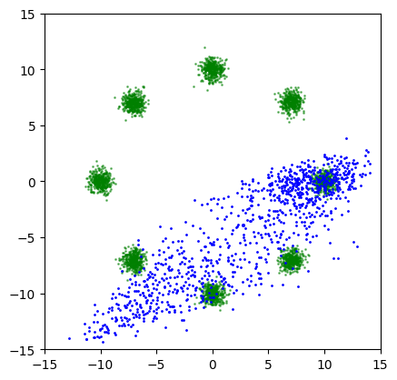</td>
        <td>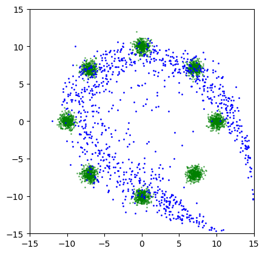</td>
        <td>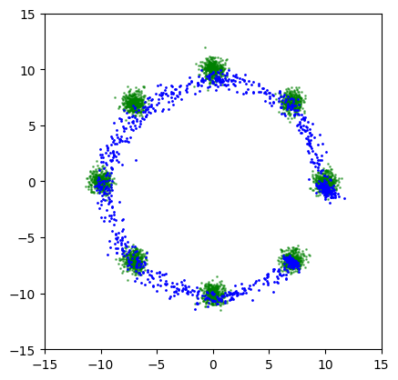</td>
        <td>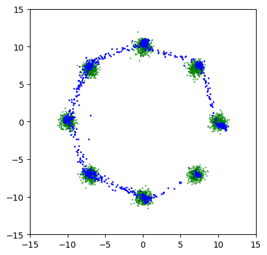</td>
        <td>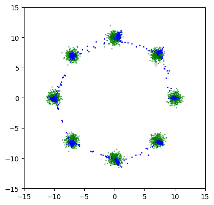</td>
    </tr>
</table>

<table style="text-align: center">
    <tr>
        <th>4000 steps</th>
        <th>8000 steps</th>
        <th>12000 steps</th>
        <th>16000 steps</th>
        <th>50000 steps</th>
    </tr>
    <tr>
        <td>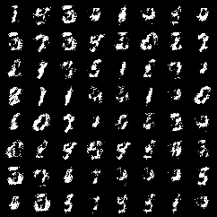</td>
        <td>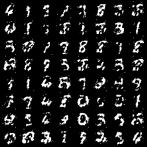</td>
        <td>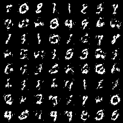</td>
        <td>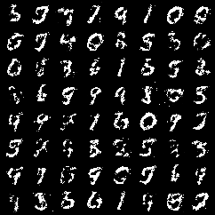</td>
        <td></td>
    </tr>
</table>
Note: The above SNGAN are trained with the vanilla GAN loss instead of the hinge loss.

SNGAN uses spectral normalization to control the Lipschitz constant of the discriminator. Even with the vanilla GAN loss, SNGAN can avoid mode collapse problem.


### LSGAN

<table style="text-align: center">
    <tr>
        <th>3000 steps</th>
        <th>6000 steps</th>
        <th>9000 steps</th>
        <th>12000 steps</th>
        <th>50000 steps</th>
    </tr>
    <tr>
        <td>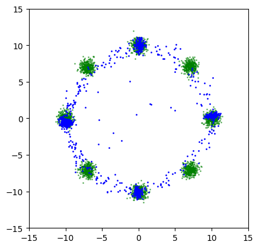</td>
        <td></td>
        <td>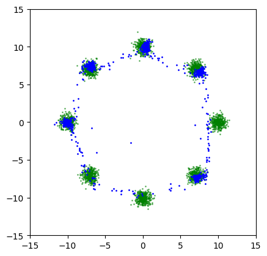</td>
        <td></td>
        <td>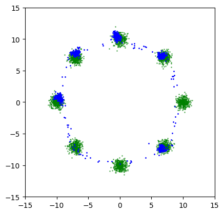</td>
    </tr>
</table>

<table style="text-align: center">
    <tr>
        <th>4000 steps</th>
        <th>8000 steps</th>
        <th>12000 steps</th>
        <th>16000 steps</th>
        <th>50000 steps</th>
    </tr>
    <tr>
        <td>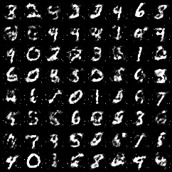</td>
        <td>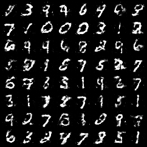</td>
        <td>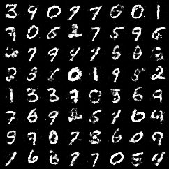</td>
        <td>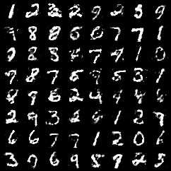</td>
        <td></td>
    </tr>
</table>

LSGAN uses MSE instead of Cross-Entropy as the loss function to overcome the vanishing gradients in vanilla GAN. However, it still suffers from the mode collapse problem. For example, as shown above, LSGAN fails to cover all 8 modes on the Ring8 dataset.

Note: Contrary to the claim in the paper, I found that LSGAN w/o batch normalization does not converge on MNIST.


## Run the code


### Train

```shell
accelerate-launch train_xxx.py -c ./configs/xxx.yaml
```


### Sample

**Unconditional**:

```shell
accelerate-launch sample.py -c ./configs/xxx.yaml \
                            --weights /path/to/saved/ckpt/model.pt \
                            --n_samples N_SAMPLES \
                            --save_dir SAVE_DIR
```

**Conditioned on class labels**:

```shell
accelerate-launch sample_cond.py -c ./configs/xxx.yaml \
                                 --weights /path/to/saved/ckpt/model.pt \
                                 --n_classes N_CLASSES \
                                 --n_samples_per_class N_SAMPLES_PER_CLASS \
                                 --save_dir SAVE_DIR
```


### Evaluate

Sample images following the instructions above and use tools like [torch-fidelity](https://github.com/toshas/torch-fidelity) to calculate FID / IS.

