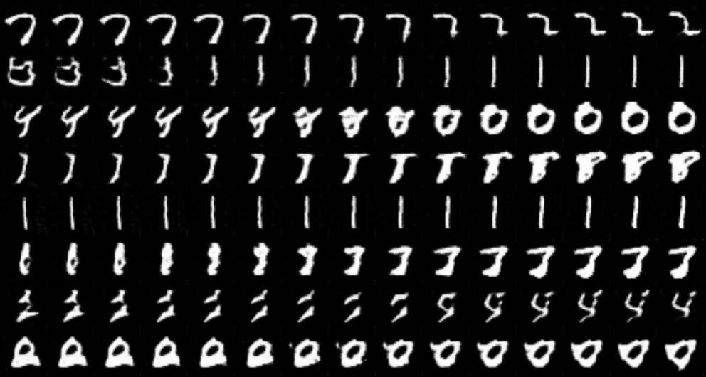
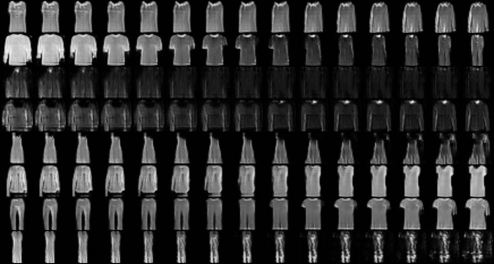
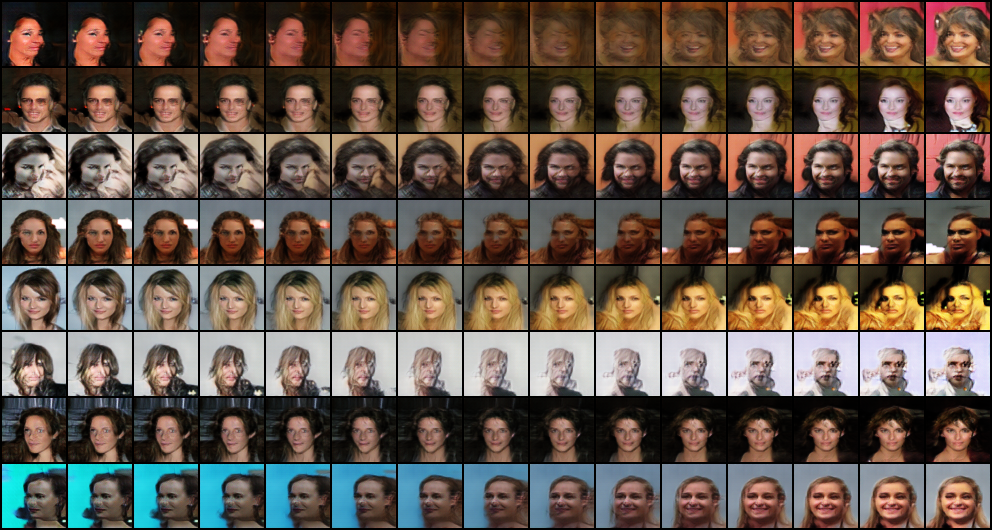

# SAGAN

> Zhang, Han, Ian Goodfellow, Dimitris Metaxas, and Augustus Odena. "Self-attention generative adversarial networks." In International conference on machine learning, pp. 7354-7363. PMLR, 2019.

## Results

注：Attention map 可视化出来一片黑，不知道是姿势不对还是有 bug，先不展示了。

### MNIST

|              samples during training               |              walk in latent space              |
| :------------------------------------------------: | :--------------------------------------------: |
|  |  |

 

### Fashion-MNIST

|                  samples during training                   |                  walk in latent space                  |
| :--------------------------------------------------------: | :----------------------------------------------------: |
|  |  |

### CelebA

|               samples during training               |              walk in latent space               |
| :-------------------------------------------------: | :---------------------------------------------: |
|  |  |