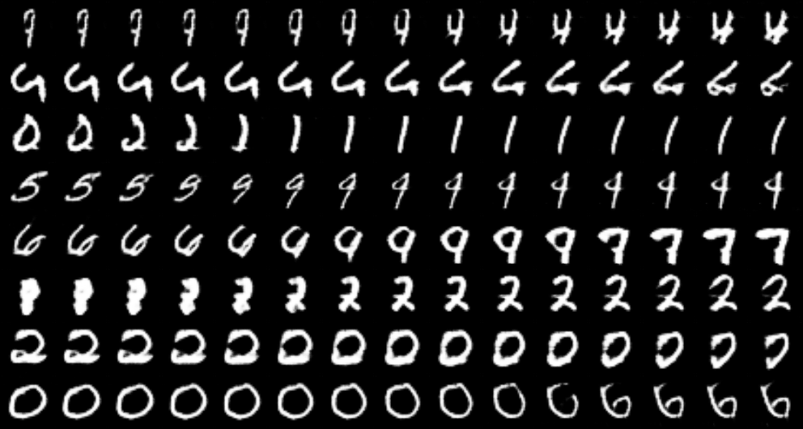
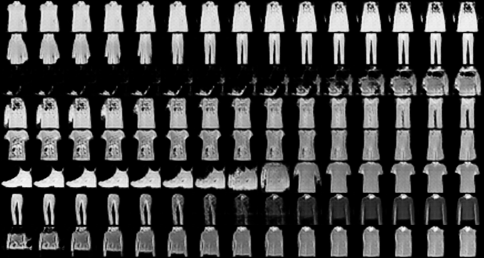
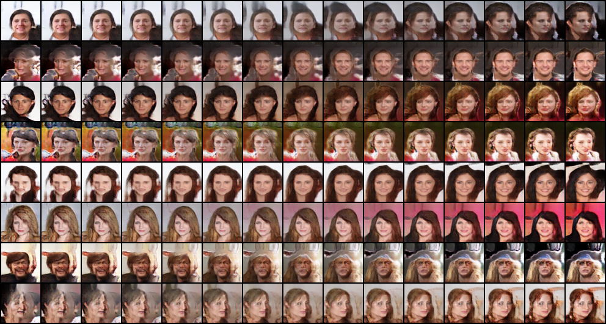

# SNGAN

> Miyato, Takeru, Toshiki Kataoka, Masanori Koyama, and Yuichi Yoshida. "Spectral normalization for generative adversarial networks." arXiv preprint arXiv:1802.05957 (2018).

## Results

### MNIST

|              samples during training               |             walk in latent space             |
| :------------------------------------------------: | :------------------------------------------: |
|  |  |

 

### Fashion-MNIST

|                 samples during training                  |                 walk in latent space                 |
| :------------------------------------------------------: |:----------------------------------------------------:|
|  |  |

### CelebA

个人经验：加入了谱归一化后，比 DCGAN 好训练了很多，无需费时费力调参。

|              samples during training              |             walk in latent space              |
| :-----------------------------------------------: |:---------------------------------------------:|
|  |  |
