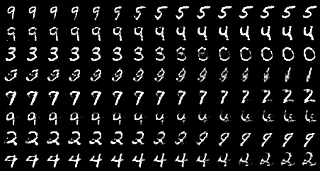

# WGAN-GP

>Gulrajani, Ishaan, Faruk Ahmed, Martin Arjovsky, Vincent Dumoulin, and Aaron Courville. "Improved training of wasserstein gans." arXiv preprint arXiv:1704.00028 (2017).

## Results

### Ring8 (Synthetic Dataset)

为验证 mode collapse 而人工合成的数据集，由 8 个正态分布排列为圆环状构成。

### Grid25 (Synthetic Dataset)

为验证 mode collapse 而人工合成的数据集，由 25 个正态分布排列为 $5\times5$ 格点构成。

### MNIST

|             samples during training              |             walk in latent space             |
| :----------------------------------------------: |:--------------------------------------------:|
|  |  |

