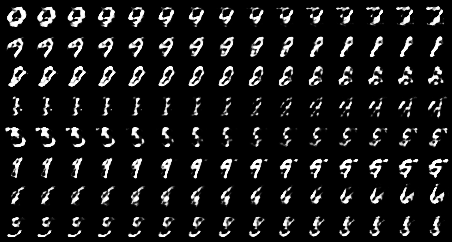

# WGAN

>Arjovsky, Martin, and Léon Bottou. "Towards principled methods for training generative adversarial networks." arXiv preprint arXiv:1701.04862 (2017).
>
>Arjovsky, Martin, Soumith Chintala, and Léon Bottou. "Wasserstein generative adversarial networks." In International conference on machine learning, pp. 214-223. PMLR, 2017.

## Results

### Ring8 (Synthetic Dataset)

为验证 mode collapse 而人工合成的数据集，由 8 个正态分布排列为圆环状构成。

### Grid25 (Synthetic Dataset)

为验证 mode collapse 而人工合成的数据集，由 25 个正态分布排列为 $5\times5$ 格点构成。

### MNIST

|             samples during training              |             walk in latent space             |
| :----------------------------------------------: |:--------------------------------------------:|
|  |  |

